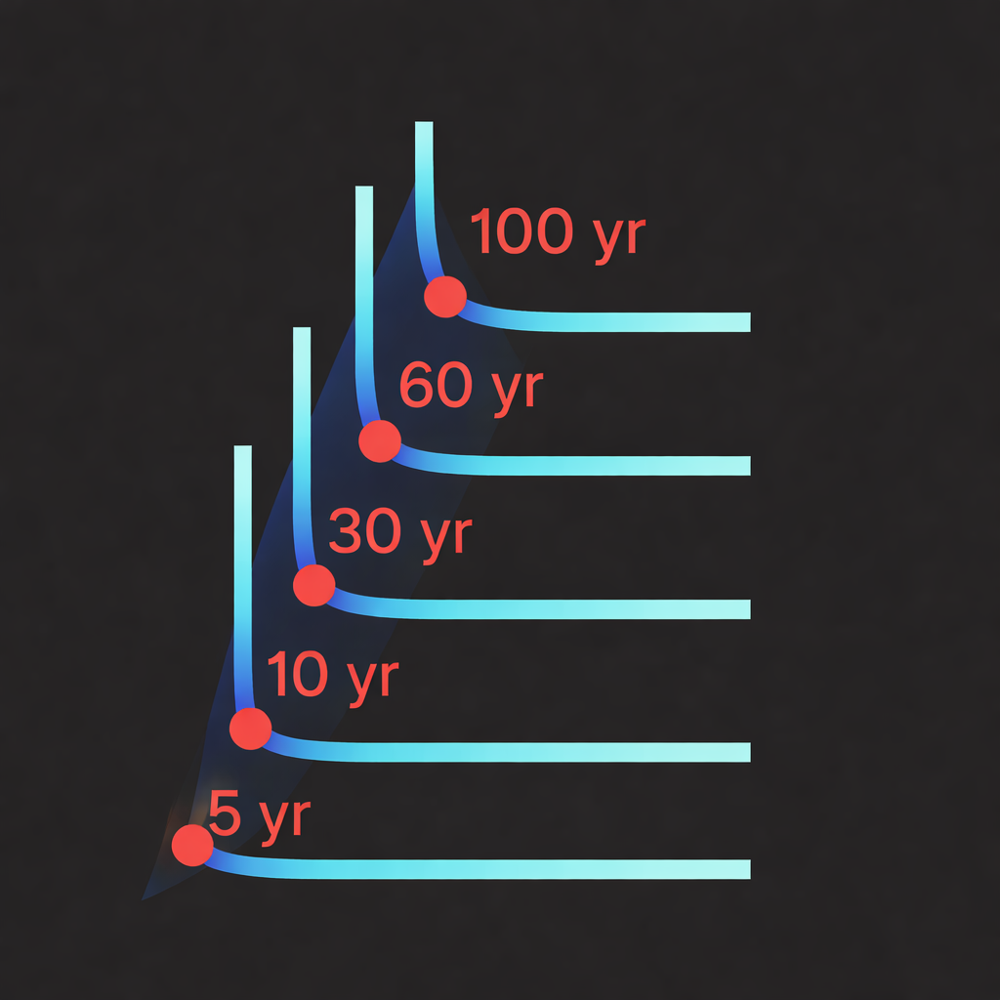
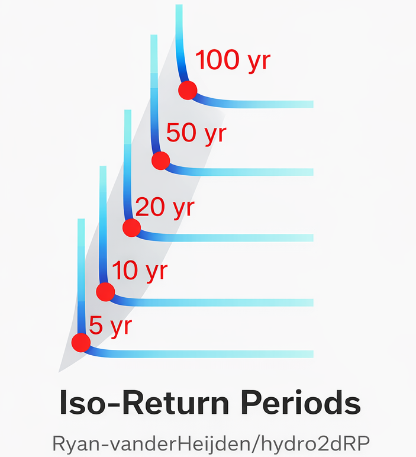

# hydro2dRP

<!--  -->

*Icon made with ChatGPT fed with real output figures.*

---

# Gumbel Copula for bivariate dependency modeling in Hydrology

Tools for bivariate extreme value analysis using the Gumbel copula, including Kendall risk contours.

See the accompanying `single_gage_example.ipynb` file for example usage. There is currently no example for using the regional pooling, but the functions are there in `regional_declustering.py` and are documented.

---

## Features

* Gumbel copula **CDF and PDF**
* **Joint return periods**

  * AND case
  * OR case
  * Kendall risk contours
* **Iso–return-period contours** in copula space
* **Transforms** from copula space to real values
* **Kendall risk contours** for different return periods
* **Regional pooling** for identifying independent regional events
* Utilities for:

  * Distribution fitting for marginals (AIC-based)
  * Colored line plotting based on likelihood with missing data handling

---

## A (brief) mathematical background
See Salvadori (2010, 2011) for more information.

Let $$( U, V \in (0,1) )$$ be marginal probability integral transforms.

The **Gumbel copula** is
$$C(u, v) = \exp\left(\left[(-\log u)^\theta + (-\log v)^\theta\right]^{1/\theta}\right), \quad \theta \ge 1$$

Common return period definitions used here:

* **AND case**:
$$T_{AND} = \frac{1}{P(U > u, V > v)} = \frac{1}{1 - u - v + C(u,v)}$$

* **OR case**:
$$T_{OR} = \frac{1}{P(U > u \cup V > v)} = \frac{1}{1 - C(u,v)}$$

* **Kendall return period**:
$$T_{K}(u,v) = \frac{1}{1−K(C(u,v))}$$

---

## Overview of return period types

| Contour type | What is fixed              | Interpretation          |
| ------------ | -------------------------- | ----------------------- |
| AND          | $$P(X>x,Y>y)$$             | simultaneous exceedance |
| OR           | $$P(X>x \text{ or } Y>y)$$ | system failure          |
| Kendall      | rank of $$C(u,v)$$         | joint extremeness       |

I'm only including an example for the Kendall risk contours, but there are functions for the AND and OR cases too.

---
## Installation / Requirements

Clone the repo and import directly.

### Dependencies

* Python ≥ 3.9
* `numpy`
* `scipy`
* `matplotlib`

Plus a few others...see the example file for some additional dependencies.

---

## Notes & limitations

* Only bivariate Gumbel copula is implemented, but you can integrate other copula functions
* No parameter estimation routines (for theta) are included, but scipy has fitting abilities for them so we don't need to add anything custom
* Numerical issues may arise for:

  * u or v extremely close to 0 or 1
  * very large theta
* Assumes continuous marginals
* Important to check that the distribution of duration and severity (or whichever variables you are using) actually are well-represented by extreme value distributions

---

## References

* Nelsen, R. B. (2006). *An Introduction to Copulas*
* Salvadori, G., et al. (2011). *Multivariate Return Periods*
* Coles, S. (2001). *An Introduction to Statistical Modeling of Extreme Values*

---

## Contact / ownership

Internal code — contact me for questions or modifications.
